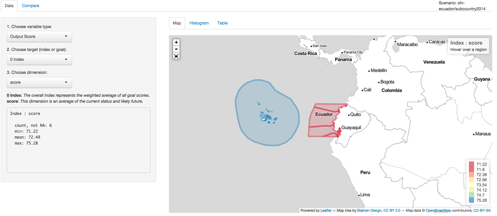
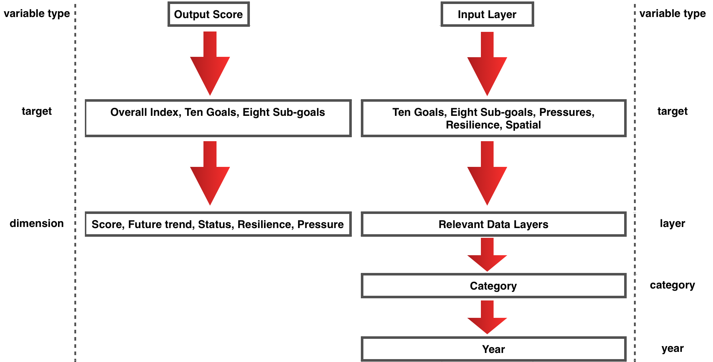

```{r, eval=TRUE, message = FALSE, echo=FALSE}

library(devtools)
library(dplyr)
library(ggplot2)
library(stringr)
library(reshape2)
suppressWarnings(require(ohicore))

```

As you are starting a regional assessment, it is important to be familiar with the Ocean Health Index Toolbox, which will be the organizational structure and data template for your assessment. Your starting point will be a web-based version of the Toolbox Application (a **Web Application**, or **WebApp**). Your WebApp can be found at a URL with your study area's name, for example: 

> **[ohi-science.shinyapps.io/ecuador](https://ohi-science.shinyapps.io/ecuador/)**. 

See the lookup table below if you have trouble finding your study area's WebApp.


# Orientation

## Data Page

The Toolbox WebApp will be on the **Data page** upon loading and will look like this:

  

The *Map* tab shows the study area (Ecuador) with its subcountry regions as identified by the Global Administrative Areas [gadm.org](www.gadm.org): El Oro, Guayas, Manabi, Galápagos and Esmeraldas. When you move your cursor over the map's regions, the region's name will appear in the top right corner of the map.  

It is also possible to see each region in a distribution on the *Histogram* tab and numerically on the *Table* tab.  
 
### Display options
  
The left panel has several drop-down menus that indicate the information being displayed: 

* choose between calculated Output Scores or prepared Input Layers from the first drop-down menu ('Choose variable type')
* select the target goal or Index to display from the second drop-down menu ('Choose target (index or goal)')
* choose the output score's dimension or the input layer's data, depending on which has been selected in the first drop-down menu. 
* additional drop-down menus will appear, depending on the selections in the first two pull-down menus. 

After selecting, you will be able to view these data in any of the three tabs (*Map, Histogram, Table*). The following figure describes the drop-down menu options you will encounter:

  
  
Information is presented just below the drop-down menus, including a description of the score or data, with a summary of the data and a source, in the case of Data Layers. 
 
 
### Template data and scores
 
**Input data and calculated scores provided in your WebApp are a template and should be updated with local information wherever possible**. This will provide a much more accurate picture of ocean health in your study area, including comparisons between subcountry regions. 
 
Data from the global assessment have been extracted for your study area and assigned to the subcountry regions within your study area, and scores have been calculated using these data. In most cases, data have been applied equally across all regions within your study area, except for some layers that were based on spatial data and were extracted individually by region. For example, compare these two input data layers:

> `Input Layer > Mariculture > Coastal population inland 25 kilometers`

and

> `Input Layer > Mariculture > Mariculture sustainability score`

and notice that *Coastal population inland 25 kilometers* has different values across all regions and *Mariculture sustainability score* has the same value across all regions. This is because of nature of the data used in the global assessment: *Coastal population inland 25 kilometers* was spatial data that could be extracted at any scale (i.e. subcountry regions) and *Mariculture sustainability score* was tabular data that has been applied equally across all regions.  

The highest priority for substituting local data for these template data should be the data layers that were applied equally across all regions. 
 
## Compare page

The **Compare page** allows you to visually track updates to data layers and scores as you modify the input layers and recalculate the scores by running the Toolbox. While not useful initially as you are just beginning your assessment, this will become very valuable to check your progress and to share with collaborators. 
 
# Lookup table of WebApp URLs
 
WebApps have been created for most coastal countries and territories. If you do not see your study area, please contact lowndes@nceas.ucsb.edu.

```{r, results='asis', echo=F}
knitr::kable(
  read.csv('~/github/ohi-webapps/tmp/webapp_status.csv') %>%
    filter(finished == 'TRUE') %>%
    
    # shorten names slightly for display
    mutate(Country = str_replace_all(Country, 
                                     fixed('South Georgia and the South Sandwich Islands'), 
                                     fixed('S. Georgia & the S. Sandwich Islands')), 
           Country = str_replace_all(Country, fixed(' and '), fixed(' & '))) %>%
    
    select(Country, URL_webapps = url_shiny_app))
```
 
 
 
 
 
 
 